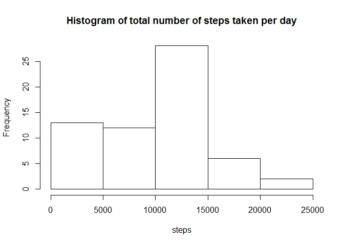
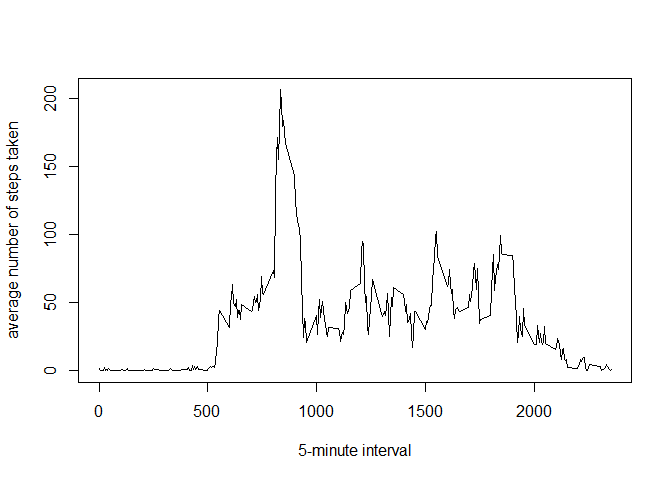
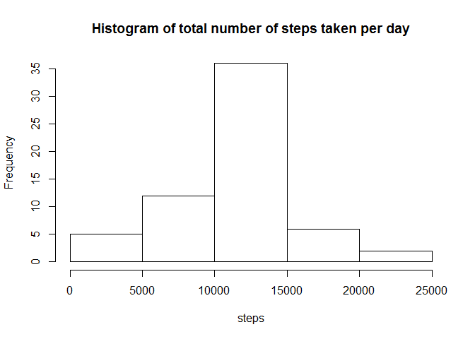
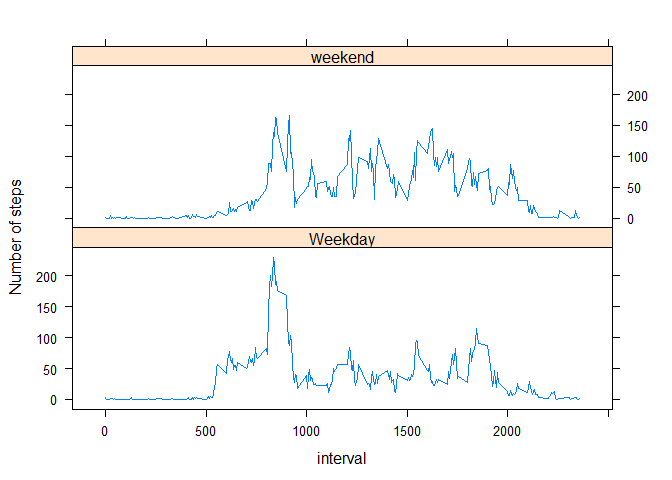

# Reproducible Research: Peer Assessment 1

## Introduction

This assignment makes use of data from a personal activity monitoring
device. This device collects data at 5 minute intervals through out the
day. The data consists of two months of data from an anonymous
individual collected during the months of October and November, 2012
and include the number of steps taken in 5 minute intervals each day.
The task is to analyze personal activity recorded in the data set.


## Loading and preprocessing the data

The data was downloaded on Fri Feb 13 10:24:02 2015 from the course web
site:
[Activity monitoring data](https://d396qusza40orc.cloudfront.net/repdata%2Fdata%2Factivity.zip) [52K],
which is a zipped csv file. The following commands are used to unzip the data file and read it into R object `data`


```r
  unzip('activity.zip','activity.csv')
  data <- read.csv('activity.csv')
```

There are three vaiables in this dataset, whose names are: **steps, date, interval**.
For analysis, I turned the `date` variable into a factor using the `as.Date()` function.
Futhermore, I choose to work with data table object using the data.table package. The R code is given here.


```r
  data$date <- as.Date(data$date,"%Y-%m-%d")

  suppressWarnings(library(data.table))
  data <- as.data.table(data)
```


## What is mean total number of steps taken per day?

To analyze the total number of steps taken per day, summation over the steps within each day is necessary. 
This can be done using the R code

```r
  perDayData <- data[, sum(steps, na.rm=TRUE), by=date]
```
where all the missing data points have been removed. The new dataset is named `perDayData`.
A histogram of the total number of steps taken each day can be generated with

```r
  hist(perDayData$V1, xlab='steps', main='Histogram of total number of steps taken per day')
```

 

The mean of total number of steps taken per day is given by

```r
  mean(perDayData$V1)
```

```
## [1] 9354.23
```
The median of total number of steps taken per day is given by

```r
  median(perDayData$V1)
```

```
## [1] 10395
```


## What is the average daily activity pattern?

To see the average daily activity pattern, averaging over the different dates is done using the code

```r
  avgDay <- data[, mean(steps,na.rm=TRUE), by=interval]
```
where the missing data points are removed again. The new data is named `avgDay`.
The following code is used to make a time series plot of the 5-minute interval (x-axis) and the average number of steps taken, averaged across all days (y-axis)

```r
  with(avgDay, plot(interval,V1, type='l', xlab='5-minute interval', ylab='average number of steps taken'))
```

 

We can find the location (the row index) of the peak activity using

```r
  which.max(avgDay$V1)
```

```
## [1] 104
```
which corresponds to the time internal

```r
  avgDay$interval[which.max(avgDay$V1)]
```

```
## [1] 835
```


## Imputing missing values

The above analysis simply ignored all the missing data points. The total number of rows with missing data
can be calculated as

```r
  nrow(data[apply(is.na(data),1,any),])
```

```
## [1] 2304
```
which is about 13% of the dataset.

A better treatment is to fill all missing data points with the corresponding average value obtained from available data.
The average value over the dates has been saved in `avgDay`. A function named `filler` is defined as

```r
  filler <- function(aDay){
                naRow<-is.na(aDay$steps)
                if (sum(naRow)>0) {aDay$steps[naRow]<-avgDay$V1[naRow]}
                aDay
            }
```
For any given day, the missing step values are replaced with the averge values in `avgDay`. 
To apply it to every day in the dataset, I will split the `data` by date, apply the `filler` function,
and then recombine the result into the original data format. This can be done via

```r
  g <- as.factor(data$date)
  cleanData <- unsplit(lapply(split(data, g), filler), g)
```
The new dataset is named `cleanData`.

Again, we make a histogram of the steps taken per day via

```r
  perDayDataCleaned <- cleanData[, sum(steps), by=date]
  hist(perDayDataCleaned$V1, xlab='steps', main='Histogram of total number of steps taken per day')
```

 

The mean is given by 
`format(mean(perDayDataCleaned$V1), digits=5)` = 10766.
The median is given by 
`format(median(perDayDataCleaned$V1), digits=5)` = 10766.

There are significant changes in the histogram, as well as the mean and median values. For example, 
the impact on the mean is 15% increase.


## Are there differences in activity patterns between weekdays and weekends?


To see the differences in activity patterns between weekdays and weekends, I first create a new factor variable `d` with two levels -- "weekday" and "weekend". This can be done with the following code

```r
  d <- weekdays(cleanData$date)
  d <- as.factor(d=='Saturday' | d=='Sunday')
  levels(d) <- c("Weekday", "weekend")
  cleanData <- as.data.table(cbind(cleanData, d))
```


Now, using the lattice package, we can make a panel plot containing a time series plot of the 5-minute interval (x-axis) and the average number of steps taken, averaged across all weekday days or weekend days (y-axis).

```r
  w <- cleanData[, mean(steps), by=c('interval', 'd')]
  
  suppressWarnings(library(lattice))
  xyplot(V1 ~ interval | d, w, type='l', layout=c(1,2), ylab='Number of steps')
```

 
